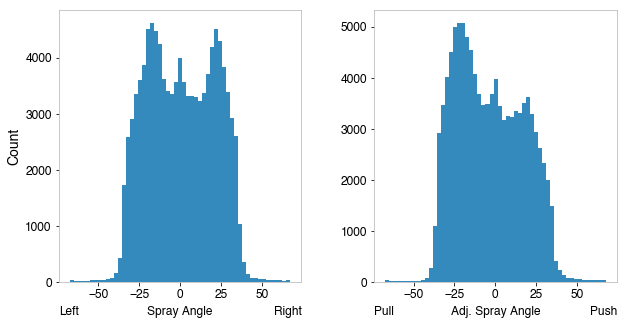

> [!NOTE]
> All public data-fetching APIs are asynchronous. Use `await` inside an async environment, or wrap calls with `asyncio.run()` in scripts.

# Baseball Savant / Statcast

Documentation and API reference for Baseball Savant (Statcast) leaderboards, pitch-level queries, game feeds, and prospect rankings.

---

## Pitch-Level Queries

Retrieve detailed pitch-level Statcast database rows.

### Functions

- `statcast(start_date: str | None = None, end_date: str | None = None, team: str | None = None, verbose: bool = True, parallel: bool = True) -> pl.DataFrame` (also available as `savant.statcast`)
- `statcast_single_game(game_pk: str | int) -> pl.DataFrame` (also available as `savant.single_game`)
- `statcast_batter(start_date: str, end_date: str, player_id: int) -> pl.DataFrame`
- `statcast_pitcher(start_date: str, end_date: str, player_id: int) -> pl.DataFrame`

### Arguments

- `start_date` / `end_date`: Date range in `YYYY-MM-DD` format.
- `team`: Optional team abbreviation (e.g. `"LAD"`, `"NYY"`, `"BOS"`).
- `verbose`: When `True`, prints retrieval progress messages.
- `parallel`: Enables concurrent downloads for large date ranges.
- `game_pk`: MLBAM game identifier.
- `player_id`: MLBAM player identifier.

---

## Batter Leaderboards

Retrieve aggregate batter performance statistics.

### Functions

- `savant.batter_exitvelo_barrels(year: int, minBBE: int | str = "q") -> pl.DataFrame`
- `savant.batter_expected_stats(year: int, minPA: int | str = "q") -> pl.DataFrame`
- `savant.batter_percentile_ranks(year: int) -> pl.DataFrame`
- `savant.batter_pitch_arsenal(year: int, minPA: int = 25) -> pl.DataFrame`
- `savant.batter_run_value(year: int) -> pl.DataFrame`
- `savant.batter_bat_tracking(year: int, minSwings: int | str = "q") -> pl.DataFrame`
- `savant.exitvelo_barrels(year: int, player_type: str = "batter", minBBE: int | str = "q") -> pl.DataFrame`
- `savant.expected_stats(year: int, player_type: str = "batter", minPA: int | str = "q") -> pl.DataFrame`
- `savant.run_value(year: int, player_type: str = "batter") -> pl.DataFrame`
- `savant.bat_tracking(year: int, player_type: str = "batter", minSwings: int | str = "q") -> pl.DataFrame`

### Arguments

- `year`: Leaderboard season.
- `minPA`, `minBBE`, `minSwings`: Minimum playing-time/event thresholds. Accept `"q"` for qualifying hitters.
- `player_type`: `"batter"` or `"pitcher"`.

---

## Pitcher Leaderboards

Retrieve aggregate pitcher performance statistics.

### Functions

- `savant.pitcher_exitvelo_barrels(year: int, minBBE: int | str = "q") -> pl.DataFrame`
- `savant.pitcher_expected_stats(year: int, minPA: int | str = "q") -> pl.DataFrame`
- `savant.pitcher_pitch_arsenal(year: int, minP: int = 250, arsenal_type: ArsenalType = ArsenalType.AVG_SPEED) -> pl.DataFrame`
- `savant.pitcher_arsenal_stats(year: int, minPA: int = 25) -> pl.DataFrame`
- `savant.pitcher_pitch_movement(year: int, minP: int | str = "q", pitch_type: str = "FF") -> pl.DataFrame`
- `savant.pitcher_active_spin(year: int, minP: int = 250) -> pl.DataFrame`
- `savant.pitcher_percentile_ranks(year: int) -> pl.DataFrame`
- `savant.pitcher_spin_dir_comp(year: int, pitch_a: str = "FF", pitch_b: str = "CH", minP: int = 100, pitcher_pov: bool = True) -> pl.DataFrame`
- `savant.pitcher_run_value(year: int) -> pl.DataFrame`
- `savant.pitcher_bat_tracking(year: int, minSwings: int | str = "q") -> pl.DataFrame`
- `savant.pitch_arsenal_stats(year: int, player_type: str = "pitcher", min_count: int = 25) -> pl.DataFrame`
- `savant.pitch_tempo(year: int, min_pitches: int = 250) -> pl.DataFrame`

### Arguments

- `minP`, `minPA`, `minBBE`, `minSwings`: Minimum pitches, plate appearances, batted ball events, or swings thresholds.
- `arsenal_type`: High-level pitch arsenal metric selection (`ArsenalType.AVG_SPEED`, etc.).
- `pitch_type`: Pitch code (e.g. `"FF"` for four-seam fastball, `"SL"` for slider).
- `pitch_a` / `pitch_b`: Pitch types to compare.
- `pitcher_pov`: Point-of-view perspective. `True` for pitcher view, `False` for batter view.

---

## Fielding Leaderboards

Retrieve specialized defensive metrics.

### Functions

- `savant.outs_above_average(year: int, pos: str, min_att: int | str = "q", view: str = "Fielder") -> pl.DataFrame`
- `savant.fielding_run_value(year: int, pos: str, min_inn: int = 100) -> pl.DataFrame`
- `savant.outfield_directional_oaa(year: int, min_opp: int | str = "q") -> pl.DataFrame`
- `savant.outfield_catch_prob(year: int, min_opp: int | str = "q") -> pl.DataFrame`
- `savant.outfielder_jump(year: int, min_att: int | str = "q") -> pl.DataFrame`
- `savant.catcher_poptime(year: int, min_2b_att: int = 5, min_3b_att: int = 0) -> pl.DataFrame`
- `savant.catcher_framing(year: int, min_called_p: int | str = "q") -> pl.DataFrame`
- `savant.arm_strength(year: int, min_throws: int = 50) -> pl.DataFrame`
- `savant.catcher_throwing(year: int, min_att: int = 5) -> pl.DataFrame`
- `savant.catcher_stance(year: int) -> pl.DataFrame`
- `savant.catcher_blocking(year: int, min_chances: int = 100) -> pl.DataFrame`

### Arguments

- `pos`: Defensive position abbreviation (e.g. `"CF"`, `"SS"`).
- `min_att`, `min_opp`, `min_throws`, `min_inn`, `min_chances`: Minimum threshold qualifiers.
- `view`: Leaderboard projection perspective (e.g. `"Fielder"`).

---

## Running Leaderboards

Retrieve baserunning, speed, and running split leaderboards.

### Functions

- `savant.sprint_speed(year: int, min_opp: int = 10) -> pl.DataFrame`
- `savant.running_splits(year: int, min_opp: int = 5, raw_splits: bool = True) -> pl.DataFrame`
- `savant.baserunning_run_value(year: int, min_opp: int = 5) -> pl.DataFrame`
- `savant.base_stealing(year: int, min_attempts: int | str = "q") -> pl.DataFrame`

### Arguments

- `min_opp`: Minimum number of sprinting opportunities.
- `raw_splits`: When `True`, returns raw split times. When `False`, returns split percentiles.
- `min_attempts`: Minimum number of stolen-base attempts.

---

## Gamefeed APIs

Retrieve JSON datasets for single or batch games, parsed directly into dataframes.

### Functions

- `savant.gamefeed_exit_velocity(game_pk: int | str) -> pl.DataFrame`
- `savant.gamefeed_exit_velocity_many(game_pks: Sequence[int | str], parallel: bool = True) -> pl.DataFrame`
- `savant.gamefeed_pitch_data(game_pk: int | str) -> pl.DataFrame`
- `savant.gamefeed_pitch_data_many(game_pks: Sequence[int | str], parallel: bool = True) -> pl.DataFrame`

### Arguments

- `game_pk`: MLB Advanced Media game identifier.
- `game_pks`: A list of game IDs to fetch and merge concurrently.

---

## Prospect Rankings

Retrieve prospect rankings and pipeline data.

### Functions

- `prospect_rankings(list_type: str = "top100", year: int | None = None) -> pl.DataFrame`
- `top_prospects(team_name: str | None = None, player_type: str | None = None) -> pl.DataFrame`

### Arguments

- `list_type`: Type of list to query (e.g. `"top100"`, `"draft"`, `"international"`, or position/team names).
- `team_name`: Target team name (e.g. `"bluejays"`, `"yankees"`).
- `player_type`: `"pitchers"` or `"batters"`.

---

## Spray Angle Utilities

The legacy `add_spray_angle` pandas utility was removed in version 2. Derived spray angles should be calculated directly with Polars expressions or Python math:

```python
from math import atan2, pi

hc_x, hc_y = 125.42, 198.27
spray_angle = atan2(hc_x - 125.42, 198.27 - hc_y) * 180 / pi
```

### Sample Distribution



---

## Example

```python
import asyncio
import polars_baseball as pb

async def main() -> None:
    # 1. Pitch-level queries
    game_df = await pb.statcast_single_game(529429)
    print("Single Game:", game_df.head(2))

    # 2. Leaderboards
    expected = await pb.savant.batter_expected_stats(2024, minPA=100)
    arsenal = await pb.savant.pitcher_pitch_arsenal(2024, minP=250)
    print("Expected Stats:", expected.head(2))
    print("Pitcher Arsenal:", arsenal.head(2))

    # 3. Fielding & Running
    oaa = await pb.savant.outs_above_average(2024, pos="CF", min_att="q")
    speed = await pb.savant.sprint_speed(2019, min_opp=50)
    print("OAACF:", oaa.head(2))
    print("Sprint Speed:", speed.head(2))

    # 4. Gamefeed
    exit_velocity = await pb.savant.gamefeed_exit_velocity(745585)
    print("Gamefeed EV:", exit_velocity.head(2))

    # 5. Prospect Rankings
    prospects = await pb.prospect_rankings("top100")
    print("Prospects:", prospects.head(2))

if __name__ == "__main__":
    asyncio.run(main())
```
